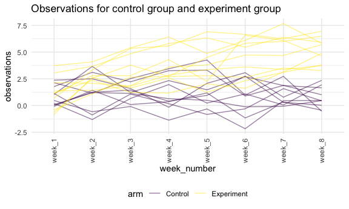

Homework 5
================

## Problem 1

Read in the data

``` r
homicide_df = 
  read.csv("./homicide_data/homicide-data.csv") %>% 
  mutate(
    city_state = str_c(city, state, sep = "_"),
    resolved = case_when(
      disposition == "Closed without arrest" ~ "unsolved",
      disposition == "Open/No arrest"        ~ "unsolved",
      disposition == "Closed by arrest"      ~ "solved"
    )
  ) %>% 
  select(city_state, resolved) %>% 
  filter(city_state != "Tulsa_AL")
```

Let’s look at this a bit

``` r
aggregate_df = 
  homicide_df %>% 
  group_by(city_state) %>% 
  summarize(
    hom_total = n(),
    hom_unsolved = sum(resolved == "unsolved")
  )
```

    ## `summarise()` ungrouping output (override with `.groups` argument)

Do a prop.test for a single city–Baltimore,

``` r
prop.test(
  aggregate_df %>% filter(city_state == "Baltimore_MD") %>% pull(hom_unsolved),
  aggregate_df %>% filter(city_state == "Baltimore_MD") %>% pull(hom_total)) %>% 
  broom::tidy()
```

    ## # A tibble: 1 x 8
    ##   estimate statistic  p.value parameter conf.low conf.high method    alternative
    ##      <dbl>     <dbl>    <dbl>     <int>    <dbl>     <dbl> <chr>     <chr>      
    ## 1    0.646      239. 6.46e-54         1    0.628     0.663 1-sample… two.sided

Try to iterate

``` r
results_df = 
  aggregate_df %>% 
  mutate(
    prop_tests = map2(.x = hom_unsolved, .y = hom_total, ~prop.test(x = .x, n = .y)),
    tidy_test = map(.x = prop_tests, ~broom::tidy(.x))
  ) %>% 
  select(-prop_tests) %>% 
  unnest(tidy_test) %>% 
  select(city_state, estimate, conf.low, conf.high)
```

``` r
results_df %>%
  mutate(city_state = fct_reorder(city_state, estimate)) %>% 
  ggplot(aes(x = city_state, y = estimate)) +
  geom_point() +
  geom_errorbar(aes(ymin = conf.low, ymax = conf.high)) + 
  theme(
    axis.text.x = element_text(angle = 90, vjust = .5, hjust = 1)
  )
```


## Problem 2

combine csv files in to a data frame

``` r
longstudy_df = 
  tibble(
    path = list.files("lda_data")
    ) %>% 
  mutate(
    path = str_c("lda_data/", path),
    data = map(.x = path, ~read_csv(.x)),
    path = str_remove(path, "lda_data/"),
    path = str_remove(path, ".csv")) %>% 
  unnest() %>% 
  separate(path, into = c("arm", "subject_id"),sep = "_") %>% 
  mutate(
    arm = ifelse(arm == "con", "Control", "Experiment")
  ) %>% 
  pivot_longer(
    week_1:week_8,
    names_to = "week_number",
    values_to = "observations"
  )
```

Make a spaghetti plot

``` r
longstudy_df %>% 
  unite("id", c(arm, subject_id), sep = "_", remove = F) %>% 
  ggplot(aes(x = week_number, y = observations, color = arm)) +
  geom_line(aes(group = as.factor(id)),alpha = .5) +
  theme(
    axis.text.x = element_text(angle = 90, vjust = .5, hjust = 1)
    )
```



From this spaghetti plot, we could see that experiment group and control
group start from the close observation value. Then the general trend of
experiment group is increasing, while control group seems like to remain
unchanged. This comment only indicate the overall trend for each group
as we can see that observations are oscillating over time for each
subject.

## Problem 3

build a function about how to calculate the estimate and p -value

``` r
sim_t_test = function(n = 30, mu, sigma = 5) {
  
  sim_data = tibble(
    x = rerun(5000, rnorm(n, mean = mu, sd = sigma)))
  
  sim_data %>% 
    mutate(
      t_test = map(.x = x, ~t.test(.x, mu = 0, paird = FALSE,
                                   conf.level = 0.95)),
      tidy_t_test = map(.x = t_test, ~broom::tidy(.x))
      ) %>% 
  select(-t_test) %>% 
  unnest(tidy_t_test) %>% 
  select(estimate, p.value)
}
```

``` r
sim_t_test(mu = 0) 
```

    ## # A tibble: 5,000 x 2
    ##    estimate p.value
    ##       <dbl>   <dbl>
    ##  1  0.519    0.542 
    ##  2  0.0701   0.935 
    ##  3 -0.848    0.419 
    ##  4 -0.823    0.416 
    ##  5  0.798    0.440 
    ##  6  1.58     0.0654
    ##  7 -0.379    0.678 
    ##  8  0.663    0.443 
    ##  9 -0.00663  0.994 
    ## 10 -1.48     0.0992
    ## # … with 4,990 more rows
