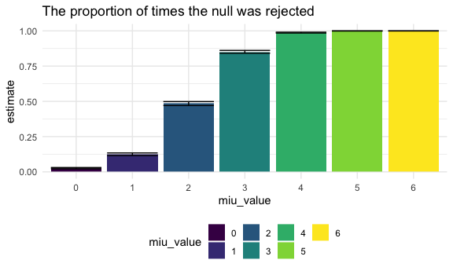
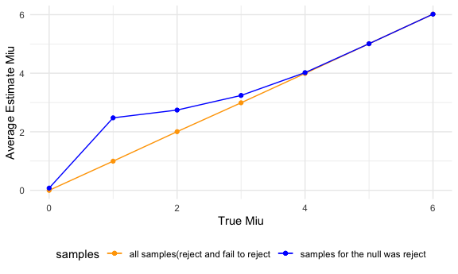

Homework 5
================

## Problem 1

Read in the data

``` r
homicide_df = 
  read.csv("./homicide_data/homicide-data.csv") %>% 
  mutate(
    city_state = str_c(city, state, sep = "_"),
    resolved = case_when(
      disposition == "Closed without arrest" ~ "unsolved",
      disposition == "Open/No arrest"        ~ "unsolved",
      disposition == "Closed by arrest"      ~ "solved"
    )
  ) %>% 
  select(city_state, resolved) %>% 
  filter(city_state != "Tulsa_AL")
```

Let’s look at this a bit

``` r
aggregate_df = 
  homicide_df %>% 
  group_by(city_state) %>% 
  summarize(
    hom_total = n(),
    hom_unsolved = sum(resolved == "unsolved")
  )
```

    ## `summarise()` ungrouping output (override with `.groups` argument)

Do a prop.test for a single city–Baltimore,

``` r
prop.test(
  aggregate_df %>% filter(city_state == "Baltimore_MD") %>% pull(hom_unsolved),
  aggregate_df %>% filter(city_state == "Baltimore_MD") %>% pull(hom_total)) %>% 
  broom::tidy()
```

    ## # A tibble: 1 x 8
    ##   estimate statistic  p.value parameter conf.low conf.high method    alternative
    ##      <dbl>     <dbl>    <dbl>     <int>    <dbl>     <dbl> <chr>     <chr>      
    ## 1    0.646      239. 6.46e-54         1    0.628     0.663 1-sample… two.sided

Try to iterate

``` r
results_df = 
  aggregate_df %>% 
  mutate(
    prop_tests = map2(.x = hom_unsolved, .y = hom_total, ~prop.test(x = .x, n = .y)),
    tidy_test = map(.x = prop_tests, ~broom::tidy(.x))
  ) %>% 
  select(-prop_tests) %>% 
  unnest(tidy_test) %>% 
  select(city_state, estimate, conf.low, conf.high)
```

``` r
results_df %>%
  mutate(city_state = fct_reorder(city_state, estimate)) %>% 
  ggplot(aes(x = city_state, y = estimate)) +
  geom_point() +
  geom_errorbar(aes(ymin = conf.low, ymax = conf.high)) + 
  theme(
    axis.text.x = element_text(angle = 90, vjust = .5, hjust = 1)
  )
```


## Problem 2

combine csv files in to a data frame

``` r
longstudy_df = 
  tibble(
    path = list.files("lda_data")
    ) %>% 
  mutate(
    path = str_c("lda_data/", path),
    data = map(.x = path, ~read_csv(.x)),
    path = str_remove(path, "lda_data/"),
    path = str_remove(path, ".csv")) %>% 
  unnest() %>% 
  separate(path, into = c("arm", "subject_id"),sep = "_") %>% 
  mutate(
    arm = ifelse(arm == "con", "Control", "Experiment")
  ) %>% 
  pivot_longer(
    week_1:week_8,
    names_to = "week_number",
    values_to = "observations"
  )
```

Make a spaghetti plot

``` r
longstudy_df %>% 
  unite("id", c(arm, subject_id), sep = "_", remove = F) %>% 
  ggplot(aes(x = week_number, y = observations, color = arm)) +
  geom_line(aes(group = as.factor(id)),alpha = .5) +
  theme(
    axis.text.x = element_text(angle = 90, vjust = .5, hjust = 1)
    ) +
  ggtitle("Observations for control group and experiment group")
```


From this spaghetti plot, we could see that experiment group and control
group start from the close observation value. Then the general trend of
experiment group is increasing, while control group seems like to remain
unchanged. This comment only indicate the overall trend for each group
as we can see that observations are oscillating over time for each
subject.

## Problem 3

Build a function about how to calculate the estimate and p -value

``` r
sim_t_test = function(n = 30, mu, sigma = 5, method = "two_sided") {
  sim_data = tibble(
    x = rerun(5000, rnorm(n, mean = mu, sd = sigma)))
  
  if (method == "two_sided") {
    
    t_critical = qt(0.975,29)
    
    sim_data %>% 
      mutate(
        t_test = map(.x = x, ~t.test(.x, mean = 0,
                                     paird = FALSE,conf.level = 0.95,
                                     alternative = "two.sided")),
        tidy_t_test = map(.x = t_test, ~broom::tidy(.x))) %>% 
      select(-t_test) %>% 
      unnest(tidy_t_test) %>% 
      select(estimate, p.value) %>% 
      mutate(
        accept_h0 = case_when(
          abs(estimate) > t_critical ~ "Reject",
          abs(estimate) <= t_critical ~ "Fail to reject"
        )
      )} 
  
  else if (method == "less") {
    t_critical = qt(0.05,29)
    
    sim_data %>% 
      mutate(
        t_test = map(.x = x, ~t.test(.x, mean = 0,
                                     paird = FALSE,conf.level = 0.95,
                                     alternative = "less")),
        tidy_t_test = map(.x = t_test, ~broom::tidy(.x))) %>% 
      select(-t_test) %>% 
      unnest(tidy_t_test) %>% 
      select(estimate, p.value) %>% 
      mutate(
        accept_h0_miu0 = case_when(
          abs(estimate) < t_critical ~ "Reject",
          abs(estimate) >= t_critical ~ "Fail to reject"
        )
      )
  }
    else if (method == "greater") {
    t_critical = qt(0.95,29)
    
    sim_data %>% 
      mutate(
        t_test = map(.x = x, ~t.test(.x, mean = 0,
                                     paird = FALSE,conf.level = 0.95,
                                     alternative = "greater")),
        tidy_t_test = map(.x = t_test, ~broom::tidy(.x))) %>% 
      select(-t_test) %>% 
      unnest(tidy_t_test) %>% 
      select(estimate, p.value) %>% 
      mutate(
        accept_h0_miu0 = case_when(
          abs(estimate) > t_critical ~ "Reject",
          abs(estimate) <= t_critical ~ "Fail to reject"
        )
      )
      }
}
```

for miu = 0, 1, 2, 3, 4, 5, 6

``` r
set.seed(1)

clean_outp_test = 
  tibble(
    miu_value = c(0, 1, 2, 3, 4, 5, 6)) %>% 
    mutate(output_lists = map(.x = miu_value, ~sim_t_test(mu = .x))) %>% 
    unnest(output_lists)

clean_outp_test
```

    ## # A tibble: 35,000 x 4
    ##    miu_value estimate p.value accept_h0     
    ##        <dbl>    <dbl>   <dbl> <chr>         
    ##  1         0    0.412  0.629  Fail to reject
    ##  2         0    0.664  0.368  Fail to reject
    ##  3         0    0.551  0.534  Fail to reject
    ##  4         0    0.567  0.487  Fail to reject
    ##  5         0   -1.65   0.0599 Fail to reject
    ##  6         0    1.19   0.229  Fail to reject
    ##  7         0    0.334  0.738  Fail to reject
    ##  8         0   -1.19   0.209  Fail to reject
    ##  9         0    0.122  0.887  Fail to reject
    ## 10         0    0.684  0.472  Fail to reject
    ## # … with 34,990 more rows

Make a plot showing the proportion of times the null was rejected (the
power of the test) on the y axis and the true value of μ on the x axis.

``` r
prop_pl =
  clean_outp_test %>% 
  group_by(miu_value) %>% 
  summarize(
    reject = sum(accept_h0 == "Reject"),
    total  = n()
  ) %>% 
  mutate(
    prop = map2(.x = reject, .y = total, ~prop.test(x = .x, n = .y)),
    tidy_test = map(.x = prop, ~broom::tidy(.x))
  ) %>% 
  select(-prop) %>% 
  unnest(tidy_test) %>% 
  select(miu_value, estimate, conf.low, conf.high)
```

    ## `summarise()` ungrouping output (override with `.groups` argument)

``` r
prop_pl %>%
  mutate(
    miu_value = as.factor(miu_value)
  ) %>% 
  ggplot(aes(x = miu_value, y = estimate, fill = miu_value)) +
  geom_bar(stat="identity") +
  geom_errorbar(aes(ymin = conf.low, ymax = conf.high)) +
  ggtitle("The proportion of times the null was rejected") +
  ylab("estimate proportion") +
  xlab("True μ value") 
```



From this plot, we could see that as the effect size of the difference
between sample mean and hypothesis population mean increases, the power
of the test that rejects the null hypothesis is increasing. And when the
true μ \>= 4, the proportion of times the null was rejected is
approximately to 1.00, which means the power of rejecting H0 gets close
to 1.

Make a plot showing the average estimate of μ̂ on the y axis and the
true value of μ on the x axis. Make a second plot (or overlay on the
first) the average estimate of μ̂ only in samples for which the null was
rejected :

``` r
null_rej_pl = 
  clean_outp_test %>% 
  filter(accept_h0 == "Reject") %>% 
  group_by(miu_value) %>% 
  summarize(
    avg_est_miu = mean(estimate)
  ) 
```

    ## `summarise()` ungrouping output (override with `.groups` argument)

``` r
clean_outp_test %>% 
  group_by(miu_value) %>% 
  summarize(
    avg_est_miu = mean(estimate)
  ) %>% 
  ggplot(aes(x = miu_value, y = avg_est_miu)) +
  geom_point(aes(color = 'a')) +
  geom_path(aes(color = 'a')) +
  geom_path(data = null_rej_pl, aes(color = 'b')) +
  geom_point(data = null_rej_pl, aes(color = 'b')) +
  scale_color_manual(name = 'samples', 
                     values =c('b'='blue','a'='orange'), 
                     labels = c('all samples(reject or fail to reject)','samples for the null was rejected')) +
  scale_x_continuous(breaks=c(0, 1, 2, 3, 4, 5, 6)) +
  ylab("Average Estimate μ") +
  xlab("True μ") +
  ggtitle("True μ vs estimate μ of samplles for the null was rejected")
```

    ## `summarise()` ungrouping output (override with `.groups` argument)



From above plot, we can easily know that the average estimate μ in
samples for which the null was rejected or fail to be rejected is equal
to the true μ since the sample size is 30 and we repeat t.test 5000
times for each μ value.  
The sample average of estimate μ across tests for which the null is
rejected is approximately equal to the true value of μ when true value
of μ is equal to 0, 4, 5, or 6.  
Since we use μ = 0 for hypothesis test and normal distribution is
symmetric at x = 0, the estimate μ for which the null is rejected should
be symmetric distribution at x = 0. Therefore, the average of estimate μ
for which the null is rejected is very close to zero(the true μ).  
From the previous plot :The proportion of times the null was rejected,
we know that the proportion of times the null was rejected is
approximately to 1.00 when the true μ \>= 4. As the power of rejecting
H0 gets very close to 1, the null was rejected for almost each sample of
5000 total samples. That’s why, the sample average of estimate μ across
tests for which the null is rejected is approximately equal to the true
value of μ when true value of μ is equal to 4, 5, or 6.  
For other true μ values(μ =1,2,or 3), the effect size is small and the
power of rejecting H0 is far away from the 1. Since there are many
sample estimate μ for which we fail to reject the null when μ = 1, 2 or
3, the sample average of μ̂ across tests for which the null is rejected
is not equal to the true value of μ.
