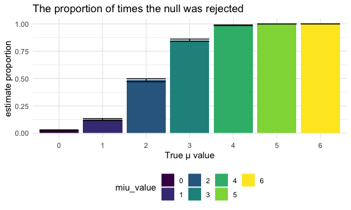

Homework 5
================

## Problem 1

Read in the data

``` r
homicide_df = 
  read.csv("./homicide_data/homicide-data.csv") %>% 
  mutate(
    city_state = str_c(city, state, sep = "_"),
    resolved = case_when(
      disposition == "Closed without arrest" ~ "unsolved",
      disposition == "Open/No arrest"        ~ "unsolved",
      disposition == "Closed by arrest"      ~ "solved"
    )
  ) %>% 
  select(city_state, resolved) %>% 
  filter(city_state != "Tulsa_AL")
```

Let’s look at this a bit

``` r
aggregate_df = 
  homicide_df %>% 
  group_by(city_state) %>% 
  summarize(
    hom_total = n(),
    hom_unsolved = sum(resolved == "unsolved")
  )
```

    ## `summarise()` ungrouping output (override with `.groups` argument)

Do a prop.test for a single city–Baltimore,

``` r
prop.test(
  aggregate_df %>% filter(city_state == "Baltimore_MD") %>% pull(hom_unsolved),
  aggregate_df %>% filter(city_state == "Baltimore_MD") %>% pull(hom_total)) %>% 
  broom::tidy()
```

    ## # A tibble: 1 x 8
    ##   estimate statistic  p.value parameter conf.low conf.high method    alternative
    ##      <dbl>     <dbl>    <dbl>     <int>    <dbl>     <dbl> <chr>     <chr>      
    ## 1    0.646      239. 6.46e-54         1    0.628     0.663 1-sample… two.sided

Try to iterate

``` r
results_df = 
  aggregate_df %>% 
  mutate(
    prop_tests = map2(.x = hom_unsolved, .y = hom_total, ~prop.test(x = .x, n = .y)),
    tidy_test = map(.x = prop_tests, ~broom::tidy(.x))
  ) %>% 
  select(-prop_tests) %>% 
  unnest(tidy_test) %>% 
  select(city_state, estimate, conf.low, conf.high)
```

``` r
results_df %>%
  mutate(city_state = fct_reorder(city_state, estimate)) %>% 
  ggplot(aes(x = city_state, y = estimate)) +
  geom_point() +
  geom_errorbar(aes(ymin = conf.low, ymax = conf.high)) + 
  theme(
    axis.text.x = element_text(angle = 90, vjust = .5, hjust = 1)
  )
```


## Problem 2

combine csv files in to a data frame

``` r
longstudy_df = 
  tibble(
    path = list.files("lda_data")
    ) %>% 
  mutate(
    path = str_c("lda_data/", path),
    data = map(.x = path, ~read_csv(.x)),
    path = str_remove(path, "lda_data/"),
    path = str_remove(path, ".csv")) %>% 
  unnest() %>% 
  separate(path, into = c("arm", "subject_id"),sep = "_") %>% 
  mutate(
    arm = ifelse(arm == "con", "Control", "Experiment")
  ) %>% 
  pivot_longer(
    week_1:week_8,
    names_to = "week_number",
    values_to = "observations"
  )
```

Make a spaghetti plot

``` r
longstudy_df %>% 
  unite("id", c(arm, subject_id), sep = "_", remove = F) %>% 
  ggplot(aes(x = week_number, y = observations, color = arm)) +
  geom_line(aes(group = as.factor(id)),alpha = .5) +
  theme(
    axis.text.x = element_text(angle = 90, vjust = .5, hjust = 1)
    )
```


From this spaghetti plot, we could see that experiment group and control
group start from the close observation value. Then the general trend of
experiment group is increasing, while control group seems like to remain
unchanged. This comment only indicate the overall trend for each group
as we can see that observations are oscillating over time for each
subject.

## Problem 3

Build a function about how to calculate the estimate and p -value

``` r
sim_t_test = function(n = 30, mu, sigma = 5, method = "two_sided") {
  sim_data = tibble(
    x = rerun(5000, rnorm(n, mean = mu, sd = sigma)))
  
  if (method == "two_sided") {
    
    t_critical = qt(0.975,29)
    
    sim_data %>% 
      mutate(
        t_test = map(.x = x, ~t.test(.x, mean = 0,
                                     paird = FALSE,conf.level = 0.95,
                                     alternative = "two.sided")),
        tidy_t_test = map(.x = t_test, ~broom::tidy(.x))) %>% 
      select(-t_test) %>% 
      unnest(tidy_t_test) %>% 
      select(estimate, p.value) %>% 
      mutate(
        accept_h0 = case_when(
          abs(estimate) > t_critical ~ "Reject",
          abs(estimate) <= t_critical ~ "Fail to reject"
        )
      )} 
  
  else if (method == "less") {
    t_critical = qt(0.05,29)
    
    sim_data %>% 
      mutate(
        t_test = map(.x = x, ~t.test(.x, mean = 0,
                                     paird = FALSE,conf.level = 0.95,
                                     alternative = "less")),
        tidy_t_test = map(.x = t_test, ~broom::tidy(.x))) %>% 
      select(-t_test) %>% 
      unnest(tidy_t_test) %>% 
      select(estimate, p.value) %>% 
      mutate(
        accept_h0_miu0 = case_when(
          abs(estimate) < t_critical ~ "Reject",
          abs(estimate) >= t_critical ~ "Fail to reject"
        )
      )
  }
    else if (method == "greater") {
    t_critical = qt(0.95,29)
    
    sim_data %>% 
      mutate(
        t_test = map(.x = x, ~t.test(.x, mean = 0,
                                     paird = FALSE,conf.level = 0.95,
                                     alternative = "greater")),
        tidy_t_test = map(.x = t_test, ~broom::tidy(.x))) %>% 
      select(-t_test) %>% 
      unnest(tidy_t_test) %>% 
      select(estimate, p.value) %>% 
      mutate(
        accept_h0_miu0 = case_when(
          abs(estimate) > t_critical ~ "Reject",
          abs(estimate) <= t_critical ~ "Fail to reject"
        )
      )
      }
}
```

for miu = 0, 1, 2, 3, 4, 5, 6

``` r
set.seed(1)

clean_outp_test = 
  tibble(
    miu_value = c(0, 1, 2, 3, 4, 5, 6)) %>% 
    mutate(output_lists = map(.x = miu_value, ~sim_t_test(mu = .x))) %>% 
    unnest(output_lists)

clean_outp_test
```

    ## # A tibble: 35,000 x 4
    ##    miu_value estimate p.value accept_h0     
    ##        <dbl>    <dbl>   <dbl> <chr>         
    ##  1         0    0.412  0.629  Fail to reject
    ##  2         0    0.664  0.368  Fail to reject
    ##  3         0    0.551  0.534  Fail to reject
    ##  4         0    0.567  0.487  Fail to reject
    ##  5         0   -1.65   0.0599 Fail to reject
    ##  6         0    1.19   0.229  Fail to reject
    ##  7         0    0.334  0.738  Fail to reject
    ##  8         0   -1.19   0.209  Fail to reject
    ##  9         0    0.122  0.887  Fail to reject
    ## 10         0    0.684  0.472  Fail to reject
    ## # … with 34,990 more rows

Make a plot showing the proportion of times the null was rejected (the
power of the test) on the y axis and the true value of μ on the x axis.

``` r
prop_pl =
  clean_outp_test %>% 
  group_by(miu_value) %>% 
  summarize(
    reject = sum(accept_h0 == "Reject"),
    total  = n()
  ) %>% 
  mutate(
    prop = map2(.x = reject, .y = total, ~prop.test(x = .x, n = .y)),
    tidy_test = map(.x = prop, ~broom::tidy(.x))
  ) %>% 
  select(-prop) %>% 
  unnest(tidy_test) %>% 
  select(miu_value, estimate, conf.low, conf.high)
```

    ## `summarise()` ungrouping output (override with `.groups` argument)

``` r
prop_pl %>%
  mutate(
    miu_value = as.factor(miu_value)
  ) %>% 
  ggplot(aes(x = miu_value, y = estimate, fill = miu_value)) +
  geom_bar(stat="identity") +
  geom_errorbar(aes(ymin = conf.low, ymax = conf.high)) +
  ggtitle("The proportion of times the null was rejected")
```



``` r
  ylab("estimate proportion")
```

    ## $y
    ## [1] "estimate proportion"
    ## 
    ## attr(,"class")
    ## [1] "labels"

From this plot, we could see that as the effect size of the difference
between sample mean and hypothesis population mean increases, the power
of the test that rejects the null hypothesis is increasing
